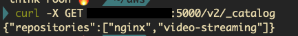

# 도커 실습
- 컨테이너 런타임 환경 구성
  - [colima: container runtime on macOS](https://github.com/abiosoft/colima)  
    - 실행 
      - `colima start --cpu 4 --memory 8`
    - docker version

- Dockerfile
  - 도커파일은 도커 이미지를 생성하기 위한 명령어를 포함하는 스크립트 파일
  - 도커파일은 MS와 관련 의존성, 파일을 정의

- 이미지로 패키징
  - `docker build`  
     `docker build -t <image-name> {--file 사용할 도커파일 지정 가능} .`  
      (-t는 이미지 이름이나 태그 설정)  
     `docker image ls` 또는 `docker images` 또는 `docker image list`
- 실행
  - `docker run`
    `docker run -d -p <host-port>:<container-port> <image-name>`  
    -d는 detache. 즉, 백그라운드에서 실행  
    -p로 host_port로 요청하면 container_port로 전달해줌!  
    `docker container list`  또는 `docker ps`
  - 검사: 컨테이너 안의 앱이 잘 동작중인지  
    `docker logs -f -n 5 <cotainer-id>`
    -f: follow log output
    -n: --tail 
    docker run할 때 -p 덕분에 `localhost:<host-port>/video`로 접근해서 비디오 잘 나오는지 확인 가능!

- 도커 레지스트리
  - MS 애저 쓰기 싫어서 aws EC2에 개인 도커 레지스트리 만듦
    - [참고](https://junhyunny.github.io/information/docker/install-docker-registry-on-ec2/)
    - [colima 사용 시 insecure-registries 설정 방법](https://github.com/abiosoft/colima/issues/225)
  - `docker tag <source_image> <target_image>`
  - `docker push <registy-url>/<image-name>:<version>`
  - `docker pull <image-name>[:tag]`  
  
  - 레지스트리에서 바로 실행하기!!!  
  `docker run -d -p <host_port>:<container_port> <registry_url>/<image_name>:<version>`

# Chapter-3

Code and examples for Chapter 3 of [Bootstrapping Microservices](https://www.bootstrapping-microservices.com).

In chapter 3 you learn how to build and publish your first microservice using Docker.

Please see README in each sub-directory for instructions on starting the particular example.

[Click here to support my work](https://www.codecapers.com.au/about#support-my-work)
